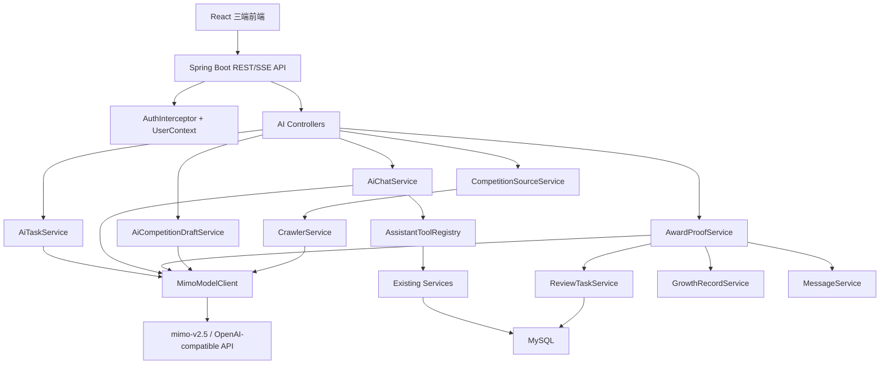
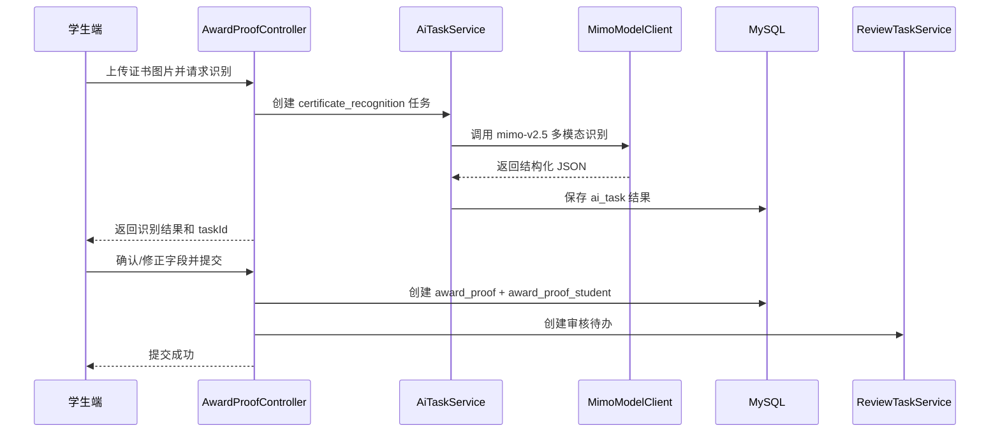
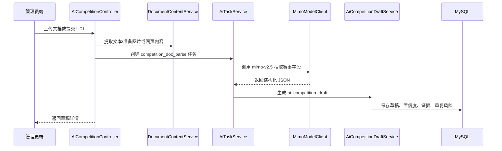
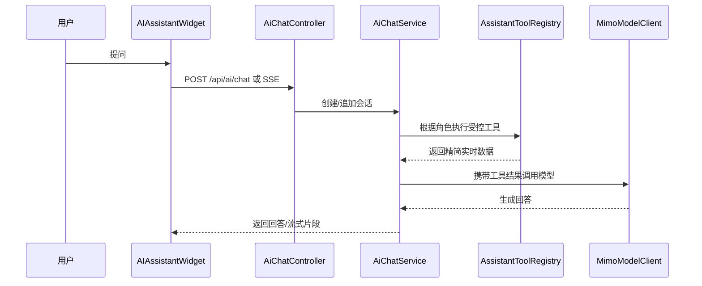
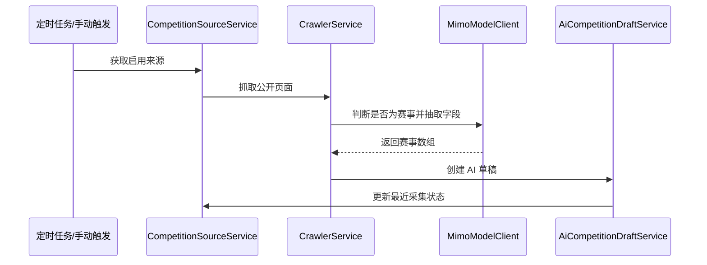

# 易赛通 AI 能力增强设计文档

适用项目：易赛通 - 高校赛事服务平台  
关联需求文档：`docs/2026-yiban-ai-requirements.md`  
参赛方向：2026 年易班创新大赛  
设计版本：v0.1  
编写日期：2026-06-05

## 1. 设计目标

本设计文档将需求文档中的 AI 能力落到当前项目的工程结构中，目标是在不推翻现有三端业务流程的前提下，为易赛通新增统一大模型能力层。

本次设计遵循以下结论：

- 全部智能能力统一接入 `mimo-v2.5` 大模型。
- 后端负责鉴权、数据范围、文件存储、网页抓取、任务编排、工具调用、结构化校验和审核流转。
- 大模型负责文档理解、证书图片识别、网页赛事抽取、对话问答、推荐理由、摘要和审核意见草稿。
- 不把 API Key 写入代码仓库或文档，统一通过 `AI_API_KEY` 环境变量注入。
- 原有报名、成果、审核、成长档案、消息通知等主流程继续可用，AI 不可用时不能阻塞核心业务。

## 2. 范围与边界

### 2.1 本期纳入设计

- 统一大模型客户端与配置。
- AI 任务中心，用于文档解析、证书识别、网页抽取和对话任务审计。
- 学生端获奖证明识别与录入。
- 管理员端文档/URL 解析生成赛事草稿。
- 管理员端赛事来源管理和 AI 草稿箱。
- 三端全局智能体对话窗口。
- 审核端 AI 识别结果展示和风险提示。
- 审核通过后写入成长档案与站内消息。

### 2.2 本期不纳入实现

- 不做独立 AI 微服务。
- 不接入传统 OCR 作为主流程。
- 不让大模型直接访问数据库。
- 不让智能体直接执行发布赛事、审核通过、提交报名等高风险写操作。
- 不把网页采集扩展到需要登录、验证码或非公开内容的网站。

## 3. 总体架构



### 3.1 分层说明

前端层：

- 复用现有 `apiClient`、`Layout`、`PageHero`、Toast 和路由体系。
- 新增 AI 组件和页面，但不改变现有三端权限入口。
- 所有 AI 接口仍走 `/api` 代理和 Bearer Token。

控制器层：

- 继续返回 `Result<T>`。
- 继续使用 `@RequireRole` 做角色限制。
- 对流式对话使用 SSE，非流式接口仍使用普通 JSON。

服务层：

- `MimoModelClient` 只负责大模型 HTTP 调用。
- `AiTaskService` 只负责任务生命周期和结果落库。
- 各业务服务负责把大模型结果接入现有业务，不把模型调用散落到控制器里。

数据层：

- 新增 AI 相关表，不破坏现有表。
- 需要与现有业务强关联的地方使用外键语义字段，例如 `competition_id`、`ai_task_id`，实际建表可不强制外键，保持当前脚本风格灵活。

## 4. 后端包结构设计

建议在 `Yiban_backend/src/main/java/com/etsaion` 下新增以下包：

```text
com.etsaion
├── config
│   └── AiProperties.java
├── controller
│   ├── AiTaskController.java
│   ├── AiCompetitionController.java
│   ├── AiChatController.java
│   ├── AwardProofController.java
│   └── CompetitionSourceController.java
├── dto
│   └── ai
│       ├── AiChatRequestDTO.java
│       ├── AiMessageDTO.java
│       ├── AiTaskCreateDTO.java
│       ├── AwardProofSubmitDTO.java
│       ├── AwardProofReviewDTO.java
│       ├── CompetitionDraftConfirmDTO.java
│       └── CompetitionSourceSaveDTO.java
├── entity
│   ├── AiTask.java
│   ├── AiCompetitionDraft.java
│   ├── AiConversation.java
│   ├── AiMessage.java
│   ├── AwardProof.java
│   ├── AwardProofStudent.java
│   └── CompetitionSource.java
├── mapper
│   ├── AiTaskMapper.java
│   ├── AiCompetitionDraftMapper.java
│   ├── AiConversationMapper.java
│   ├── AiMessageMapper.java
│   ├── AwardProofMapper.java
│   ├── AwardProofStudentMapper.java
│   └── CompetitionSourceMapper.java
├── service
│   ├── ai
│   │   ├── MimoModelClient.java
│   │   ├── AiPromptService.java
│   │   ├── AiJsonSchemaService.java
│   │   ├── AiTaskService.java
│   │   ├── AiCompetitionDraftService.java
│   │   ├── AiChatService.java
│   │   ├── AssistantToolRegistry.java
│   │   ├── CrawlerService.java
│   │   └── DocumentContentService.java
│   ├── AwardProofService.java
│   └── CompetitionSourceService.java
└── vo
    └── ai
        ├── AiTaskVO.java
        ├── AiCompetitionDraftVO.java
        ├── AiChatResponseVO.java
        ├── AwardProofVO.java
        └── CompetitionSourceVO.java
```

## 5. 大模型接入设计

### 5.1 配置

在 `application.yml` 中新增：

```yaml
ai:
  base-url: ${AI_BASE_URL:https://token-plan-cn.xiaomimimo.com/v1}
  api-key: ${AI_API_KEY:}
  model: ${AI_MODEL:mimo-v2.5}
  context-window: ${AI_CONTEXT_WINDOW:1000000}
  timeout-seconds: ${AI_TIMEOUT_SECONDS:120}
  max-retries: ${AI_MAX_RETRIES:2}
```

说明：

- `AI_API_KEY` 必须通过运行环境提供。
- `context-window` 是平台侧的提示词预算配置，不强制假设每次 API 都需要传该字段。
- 若生产环境未配置 `AI_API_KEY`，AI 接口返回明确错误，但不影响普通业务接口。

### 5.2 `AiProperties`

职责：

- 读取 `ai.*` 配置。
- 校验 `apiKey` 是否为空。
- 给 `MimoModelClient` 提供 base URL、模型名、超时、重试次数。

### 5.3 `MimoModelClient`

职责：

- 封装 OpenAI-compatible Chat Completions 请求。
- 支持文本、图片 URL、上下文消息、JSON 输出提示。
- 统一处理超时、重试、错误响应、调用日志。
- 不保存完整 API Key，不在日志中输出请求 Authorization。

建议方法：

```java
String chatJson(String systemPrompt, String userPrompt, Map<String, Object> schemaHint);
String chatText(String systemPrompt, List<AiMessageDTO> messages);
String chatVisionJson(String systemPrompt, String imageUrl, String userPrompt, Map<String, Object> schemaHint);
```

### 5.4 JSON 结构化校验

`AiJsonSchemaService` 负责：

- 从模型输出中提取 JSON。
- 用 Jackson/Hutool JSON 解析为指定 DTO。
- 校验必需字段、日期格式、枚举值、置信度范围。
- JSON 解析失败时调用一次“JSON 修复提示词”，仍失败则任务标记 failed。

所有关键任务必须落库：

- 原始模型响应：`raw_result_json`。
- 校验后的结构化结果：`result_json`。
- 错误原因：`error_message`。
- 置信度：`confidence`。

## 6. 数据库设计

新增脚本建议命名：

```text
Yiban_backend/db/migrate-ai-001.sql
```

后续确认实现时，也可以将表结构合并进 `000-schema.sql`。

### 6.1 `ai_task`

用于所有 AI 异步任务。

```sql
CREATE TABLE `ai_task` (
  `id` bigint NOT NULL AUTO_INCREMENT,
  `task_type` varchar(50) NOT NULL COMMENT 'competition_doc_parse/certificate_recognition/crawler_parse/chat',
  `status` varchar(30) NOT NULL DEFAULT 'pending' COMMENT 'pending/running/succeeded/failed/cancelled',
  `source_type` varchar(30) DEFAULT NULL COMMENT 'file/image/url/text/chat',
  `source_url` varchar(1000) DEFAULT NULL,
  `source_hash` varchar(128) DEFAULT NULL,
  `requester_id` bigint DEFAULT NULL,
  `requester_role` varchar(20) DEFAULT NULL,
  `prompt_version` varchar(50) DEFAULT NULL,
  `model_name` varchar(100) DEFAULT 'mimo-v2.5',
  `confidence` decimal(5,4) DEFAULT NULL,
  `raw_result_json` longtext DEFAULT NULL,
  `result_json` longtext DEFAULT NULL,
  `error_message` varchar(1000) DEFAULT NULL,
  `start_time` datetime DEFAULT NULL,
  `finish_time` datetime DEFAULT NULL,
  `create_time` datetime DEFAULT CURRENT_TIMESTAMP,
  `update_time` datetime DEFAULT CURRENT_TIMESTAMP ON UPDATE CURRENT_TIMESTAMP,
  PRIMARY KEY (`id`),
  KEY `idx_task_status` (`task_type`, `status`),
  KEY `idx_requester` (`requester_id`),
  KEY `idx_source_hash` (`source_hash`)
) ENGINE=InnoDB DEFAULT CHARSET=utf8mb4 COMMENT='AI任务表';
```

### 6.2 `ai_competition_draft`

该表作为 AI 草稿箱的暂存区。管理员确认后再创建或更新 `competition`，避免未确认内容污染正式赛事表。

```sql
CREATE TABLE `ai_competition_draft` (
  `id` bigint NOT NULL AUTO_INCREMENT,
  `ai_task_id` bigint DEFAULT NULL,
  `competition_id` bigint DEFAULT NULL COMMENT '确认保存后关联competition',
  `source_type` varchar(30) DEFAULT NULL,
  `source_url` varchar(1000) DEFAULT NULL,
  `source_title` varchar(300) DEFAULT NULL,
  `name` varchar(200) DEFAULT NULL,
  `level` varchar(20) DEFAULT NULL,
  `category` varchar(50) DEFAULT NULL,
  `organizer` varchar(200) DEFAULT NULL,
  `start_time` datetime DEFAULT NULL,
  `end_time` datetime DEFAULT NULL,
  `competition_start` datetime DEFAULT NULL,
  `competition_end` datetime DEFAULT NULL,
  `max_team_size` int DEFAULT 1,
  `cover_url` varchar(500) DEFAULT NULL,
  `content` longtext DEFAULT NULL,
  `tags` varchar(500) DEFAULT NULL,
  `tracks` varchar(1000) DEFAULT NULL,
  `stages_json` longtext DEFAULT NULL,
  `field_confidence_json` longtext DEFAULT NULL,
  `evidence_json` longtext DEFAULT NULL,
  `duplicate_competition_id` bigint DEFAULT NULL,
  `duplicate_score` decimal(5,4) DEFAULT NULL,
  `status` varchar(30) DEFAULT 'pending_review' COMMENT 'pending_review/confirmed/ignored/merged',
  `reviewer_id` bigint DEFAULT NULL,
  `review_note` varchar(500) DEFAULT NULL,
  `create_time` datetime DEFAULT CURRENT_TIMESTAMP,
  `update_time` datetime DEFAULT CURRENT_TIMESTAMP ON UPDATE CURRENT_TIMESTAMP,
  PRIMARY KEY (`id`),
  KEY `idx_status` (`status`),
  KEY `idx_ai_task` (`ai_task_id`),
  KEY `idx_competition` (`competition_id`)
) ENGINE=InnoDB DEFAULT CHARSET=utf8mb4 COMMENT='AI赛事草稿表';
```

### 6.3 `award_proof`

用于获奖证书识别、学生确认和审核。

```sql
CREATE TABLE `award_proof` (
  `id` bigint NOT NULL AUTO_INCREMENT,
  `ai_task_id` bigint DEFAULT NULL,
  `submitter_id` bigint NOT NULL,
  `competition_id` bigint DEFAULT NULL,
  `competition_name` varchar(200) DEFAULT NULL,
  `award_level` varchar(100) DEFAULT NULL,
  `award_time` datetime DEFAULT NULL,
  `organizer` varchar(200) DEFAULT NULL,
  `winner_name` varchar(100) DEFAULT NULL,
  `certificate_no` varchar(100) DEFAULT NULL,
  `seal_text` varchar(300) DEFAULT NULL,
  `file_name` varchar(255) DEFAULT NULL,
  `file_url` varchar(1000) NOT NULL,
  `file_hash` varchar(128) DEFAULT NULL,
  `confidence` decimal(5,4) DEFAULT NULL,
  `field_confidence_json` longtext DEFAULT NULL,
  `evidence_json` longtext DEFAULT NULL,
  `risk_flags_json` longtext DEFAULT NULL,
  `status` varchar(30) DEFAULT 'pending' COMMENT 'pending/approved/rejected/returned',
  `review_note` varchar(500) DEFAULT NULL,
  `reviewer_id` bigint DEFAULT NULL,
  `review_time` datetime DEFAULT NULL,
  `create_time` datetime DEFAULT CURRENT_TIMESTAMP,
  `update_time` datetime DEFAULT CURRENT_TIMESTAMP ON UPDATE CURRENT_TIMESTAMP,
  PRIMARY KEY (`id`),
  KEY `idx_submitter` (`submitter_id`),
  KEY `idx_competition` (`competition_id`),
  KEY `idx_status` (`status`),
  KEY `idx_file_hash` (`file_hash`)
) ENGINE=InnoDB DEFAULT CHARSET=utf8mb4 COMMENT='获奖证明表';
```

### 6.4 `award_proof_student`

支持团队奖项关联多个学生。

```sql
CREATE TABLE `award_proof_student` (
  `id` bigint NOT NULL AUTO_INCREMENT,
  `award_proof_id` bigint NOT NULL,
  `student_id` bigint NOT NULL,
  `create_time` datetime DEFAULT CURRENT_TIMESTAMP,
  PRIMARY KEY (`id`),
  UNIQUE KEY `uk_award_student` (`award_proof_id`, `student_id`),
  KEY `idx_student` (`student_id`)
) ENGINE=InnoDB DEFAULT CHARSET=utf8mb4 COMMENT='获奖证明学生关联表';
```

### 6.5 `competition_source`

用于赛事来源管理。

```sql
CREATE TABLE `competition_source` (
  `id` bigint NOT NULL AUTO_INCREMENT,
  `name` varchar(200) NOT NULL,
  `url` varchar(1000) NOT NULL,
  `source_type` varchar(30) DEFAULT 'custom' COMMENT 'whitelist/school/government/enterprise/custom',
  `crawl_frequency` varchar(30) DEFAULT 'manual' COMMENT 'manual/daily/weekly',
  `enabled` tinyint DEFAULT 1,
  `last_crawl_time` datetime DEFAULT NULL,
  `last_crawl_status` varchar(30) DEFAULT NULL,
  `last_error_message` varchar(1000) DEFAULT NULL,
  `create_time` datetime DEFAULT CURRENT_TIMESTAMP,
  `update_time` datetime DEFAULT CURRENT_TIMESTAMP ON UPDATE CURRENT_TIMESTAMP,
  PRIMARY KEY (`id`),
  KEY `idx_enabled` (`enabled`),
  KEY `idx_type` (`source_type`)
) ENGINE=InnoDB DEFAULT CHARSET=utf8mb4 COMMENT='赛事采集来源表';
```

### 6.6 `ai_conversation` 与 `ai_message`

```sql
CREATE TABLE `ai_conversation` (
  `id` bigint NOT NULL AUTO_INCREMENT,
  `user_id` bigint NOT NULL,
  `role` varchar(20) NOT NULL,
  `title` varchar(200) DEFAULT NULL,
  `last_message_at` datetime DEFAULT NULL,
  `create_time` datetime DEFAULT CURRENT_TIMESTAMP,
  `update_time` datetime DEFAULT CURRENT_TIMESTAMP ON UPDATE CURRENT_TIMESTAMP,
  PRIMARY KEY (`id`),
  KEY `idx_user_time` (`user_id`, `last_message_at`)
) ENGINE=InnoDB DEFAULT CHARSET=utf8mb4 COMMENT='AI对话会话表';

CREATE TABLE `ai_message` (
  `id` bigint NOT NULL AUTO_INCREMENT,
  `conversation_id` bigint NOT NULL,
  `role` varchar(20) NOT NULL COMMENT 'user/assistant/tool/system',
  `content` longtext NOT NULL,
  `tool_name` varchar(100) DEFAULT NULL,
  `tool_result_json` longtext DEFAULT NULL,
  `create_time` datetime DEFAULT CURRENT_TIMESTAMP,
  PRIMARY KEY (`id`),
  KEY `idx_conversation` (`conversation_id`)
) ENGINE=InnoDB DEFAULT CHARSET=utf8mb4 COMMENT='AI对话消息表';
```

## 7. 核心流程设计

### 7.1 证书识别与录入



审核通过流程：

1. 教师或管理员在审核页查看原图、AI 字段、风险提示和学生修正字段。
2. 调用 `POST /api/award-proof/review`。
3. 更新 `award_proof.status=approved`。
4. 关闭对应 `review_task`。
5. 为 `award_proof_student` 中每个学生写入 `growth_record`。
6. 发送站内消息。

风险规则由后端和大模型共同完成：

- 后端负责文件 hash 重复检测。
- 后端负责同一学生同一赛事同一奖项重复检测。
- 大模型负责图片内容异常、信息缺失、字段不一致等语义风险提示。

### 7.2 AI 文档解析生成赛事草稿



管理员确认流程：

1. 管理员在 AI 草稿箱查看草稿。
2. 可编辑所有字段。
3. 点击“保存为赛事草稿”时创建 `competition.status=draft`。
4. 同步创建 `competition_stage`。
5. 草稿状态改为 `confirmed`。
6. 后续发布沿用现有 `CompetitionPublish` 更新接口。

### 7.3 全局智能体



工具调用设计：

- 工具不是由模型直接执行，而是 `AiChatService` 根据用户问题、快捷问题或模型工具计划执行。
- 每个工具必须做角色校验。
- 工具结果必须限制数量和字段，避免把整库数据塞给模型。
- 回答中需要标明数据更新时间。

### 7.4 赛事网页采集



采集策略：

- v1 支持手动触发，定时任务作为增强。
- 每个来源单次最多生成 10 条草稿。
- 对标题和主办单位近似的草稿进行重复检测。
- 抓取失败不会中断其他来源。

## 8. 后端接口设计

所有接口返回 `Result<T>`，前端通过现有 `apiClient` 自动解包。

### 8.1 AI 任务

| 方法 | 路径 | 角色 | 说明 |
| --- | --- | --- | --- |
| GET | `/api/ai/task/{id}` | student/teacher/admin | 查询本人可见任务 |
| GET | `/api/ai/task/list` | admin | 管理员分页查询 AI 任务 |
| POST | `/api/ai/task/{id}/retry` | admin | 重试失败任务 |

### 8.2 赛事 AI 导入

| 方法 | 路径 | 角色 | 说明 |
| --- | --- | --- | --- |
| POST | `/api/ai/competition/parse-file` | admin | 上传文件并解析赛事 |
| POST | `/api/ai/competition/parse-url` | admin | 输入 URL 并解析赛事 |
| GET | `/api/ai/competition/drafts` | admin | AI 草稿箱列表 |
| GET | `/api/ai/competition/drafts/{id}` | admin | 草稿详情 |
| PUT | `/api/ai/competition/drafts/{id}` | admin | 编辑草稿字段 |
| POST | `/api/ai/competition/drafts/{id}/confirm` | admin | 保存为 `competition.status=draft` |
| POST | `/api/ai/competition/drafts/{id}/ignore` | admin | 忽略草稿 |

### 8.3 获奖证明

| 方法 | 路径 | 角色 | 说明 |
| --- | --- | --- | --- |
| POST | `/api/ai/certificate/recognize` | student | 上传/指定图片并识别 |
| POST | `/api/award-proof/submit` | student | 确认识别结果并提交审核 |
| GET | `/api/award-proof/my` | student | 我的获奖证明 |
| GET | `/api/award-proof/audit-list` | teacher/admin | 待审核列表 |
| GET | `/api/award-proof/{id}` | student/teacher/admin | 详情，按权限控制 |
| POST | `/api/award-proof/review` | teacher/admin | 审核通过/驳回/退回 |

### 8.4 智能体

| 方法 | 路径 | 角色 | 说明 |
| --- | --- | --- | --- |
| POST | `/api/ai/chat` | student/teacher/admin | 非流式对话 |
| POST | `/api/ai/chat/stream` | student/teacher/admin | SSE 流式对话 |
| GET | `/api/ai/chat/conversations` | student/teacher/admin | 当前用户会话列表 |
| GET | `/api/ai/chat/conversations/{id}` | student/teacher/admin | 当前用户会话详情 |
| DELETE | `/api/ai/chat/conversations/{id}` | student/teacher/admin | 删除当前用户会话 |

### 8.5 采集来源

| 方法 | 路径 | 角色 | 说明 |
| --- | --- | --- | --- |
| GET | `/api/admin/competition-sources` | admin | 来源列表 |
| POST | `/api/admin/competition-sources` | admin | 新增来源 |
| PUT | `/api/admin/competition-sources/{id}` | admin | 更新来源 |
| DELETE | `/api/admin/competition-sources/{id}` | admin | 删除来源 |
| POST | `/api/admin/competition-sources/{id}/crawl` | admin | 手动采集 |

## 9. 前端设计

### 9.1 新增组件

```text
Yiban/src/components/ai/
├── AIAssistantWidget.tsx
├── ChatMessageList.tsx
├── ChatInputBar.tsx
├── QuickPromptChips.tsx
├── AiTaskStatusPill.tsx
├── FieldConfidenceBadge.tsx
├── EvidenceDrawer.tsx
└── RiskFlagList.tsx
```

组件职责：

- `AIAssistantWidget`：挂载在 `Layout.tsx`，根据当前用户角色展示快捷问题。
- `FieldConfidenceBadge`：展示字段置信度，低于阈值使用警示样式。
- `EvidenceDrawer`：展示模型识别证据、来源片段、原图链接。
- `RiskFlagList`：展示重复证书、姓名不一致、低置信度等风险。

### 9.2 新增页面

```text
Yiban/src/pages/admin/
├── AiCompetitionImport.tsx
├── AiCompetitionDrafts.tsx
└── CompetitionSourceManagement.tsx

Yiban/src/pages/student/
└── AwardProofs.tsx

Yiban/src/pages/teacher/
└── AwardProofAudit.tsx
```

若时间紧，第一阶段可以不单独新增 `AwardProofs.tsx`，直接在现有 `AchievementUpload.tsx` 中完成证书识别、确认和提交。

### 9.3 路由建议

管理员：

- `/admin/ai-import`
- `/admin/ai-drafts`
- `/admin/competition-sources`

学生：

- `/student/award-proofs`
- 现有 `/student/achievements/upload` 增加 AI 识别入口。

教师：

- `/teacher/award-proof-audit`
- 也可复用现有 `/teacher/audit` 增加“获奖证明”标签页。

### 9.4 前端交互约定

- 长任务提交后立即展示任务状态，不阻塞页面。
- 识别结果自动填表，但所有字段允许人工修改。
- 低置信度字段默认展开提示。
- 流式对话失败时回退到非流式对话。
- 证书识别、文档解析、草稿确认等操作均使用 Toast 给出明确反馈。

## 10. 智能体工具设计

### 10.1 工具列表

| 工具 | 输入 | 输出 | 权限 |
| --- | --- | --- | --- |
| `searchCompetitions` | keyword/status/level/category | 赛事摘要列表 | 三端，非管理员仅 published |
| `getCompetitionDetail` | competitionId | 赛事详情和阶段 | 三端，非管理员仅 published |
| `getMyRegistrations` | none | 当前学生报名状态 | student |
| `getMySubmissions` | none | 当前学生成果状态 | student |
| `getMyAwardProofs` | none | 当前学生获奖证明 | student |
| `getReviewSummary` | targetType | 待审核统计 | teacher/admin |
| `getStudentGrowth` | studentId | 成长档案摘要 | student 本人/teacher 同学院/admin |
| `getDraftCompetitionSummary` | none | AI 草稿统计 | admin |
| `getAiTaskStatus` | taskId | AI 任务状态 | 发起人/admin |

### 10.2 权限策略

工具权限必须在后端服务中判断，不能依赖前端隐藏入口。

学生：

- 只能看自己的报名、成果、证书、成长档案。
- 查询赛事只返回 published。

教师：

- 只能看本学院学生数据。
- 查询学生成长时需要校验 `User.college`。

管理员：

- 可查看全部赛事、草稿、AI 任务、审核统计。

### 10.3 响应约束

模型回答必须：

- 简洁。
- 基于工具结果。
- 标明数据更新时间。
- 对无法确认的信息明确说明。
- 对写操作引导用户点击页面按钮，不直接伪造已完成状态。

## 11. Prompt 设计

### 11.1 Prompt 版本

每类任务维护 prompt 版本：

- `competition_parse_v1`
- `certificate_recognition_v1`
- `crawler_competition_extract_v1`
- `assistant_student_v1`
- `assistant_teacher_v1`
- `assistant_admin_v1`

版本号写入 `ai_task.prompt_version`，方便后续定位识别效果变化。

### 11.2 文档解析输出 Schema

核心字段：

```json
{
  "competitions": [
    {
      "name": "",
      "level": "",
      "category": "",
      "organizer": "",
      "startTime": "",
      "endTime": "",
      "competitionStart": "",
      "competitionEnd": "",
      "maxTeamSize": 1,
      "coverUrl": "",
      "content": "",
      "tags": [],
      "tracks": [],
      "stages": [],
      "fieldConfidence": {},
      "evidence": {},
      "riskFlags": []
    }
  ]
}
```

### 11.3 证书识别输出 Schema

```json
{
  "competitionName": "",
  "awardLevel": "",
  "awardTime": "",
  "organizer": "",
  "winnerName": "",
  "certificateNo": "",
  "sealText": "",
  "confidence": 0.0,
  "fieldConfidence": {},
  "evidence": {},
  "riskFlags": []
}
```

### 11.4 网页抽取输出 Schema

```json
{
  "isCompetitionPage": true,
  "sourceTitle": "",
  "competitions": [],
  "reason": "",
  "confidence": 0.0
}
```

## 12. 异步任务与重试

### 12.1 执行方式

第一阶段使用 Spring `ThreadPoolTaskExecutor` 或 `@Async` 执行 AI 任务，状态存入 MySQL。当前项目虽然文档提到 Redis，但 `application.yml` 排除了 Redis 自动配置，因此 v1 不依赖 Redis。

任务状态：

- `pending`
- `running`
- `succeeded`
- `failed`
- `cancelled`

### 12.2 重试策略

- 模型调用网络错误：最多重试 `AI_MAX_RETRIES` 次。
- JSON 解析失败：调用一次 JSON 修复提示词。
- 文件不可读、权限不足、URL 非法：不重试，直接 failed。
- 管理员可对 failed 任务手动重试。

### 12.3 幂等策略

- 文件任务计算 `source_hash`。
- 相同 hash 的证书图片短时间内复用识别结果。
- 相同 URL 若页面内容 hash 未变化，不重复生成草稿。
- `award_proof.file_hash` 用于重复证明提示。

## 13. 安全设计

### 13.1 密钥安全

- `AI_API_KEY` 只通过环境变量注入。
- 日志中禁止输出 Authorization。
- Swagger 示例不展示真实 key。
- 本设计文档不保存用户提供的明文 key。

### 13.2 数据安全

- 智能体工具调用按角色过滤。
- 模型输入中不包含密码、Token、数据库连接串。
- 上传文件 URL 若为私有七牛资源，应使用短期签名 URL 或后端代理读取。
- AI 对话记录可保存，但不保存敏感凭据。

### 13.3 操作安全

- 智能体不直接执行发布、审核、删除等高风险写操作。
- AI 草稿必须由管理员确认。
- 证书识别必须由学生确认，审核必须由教师或管理员确认。
- 低置信度结果必须保留人工确认提示。

## 14. 兼容现有业务

### 14.1 与 `competition`

- AI 草稿确认后创建 `competition.status=draft`。
- 管理员发布仍走现有 `/competition/admin/update/{id}` 或发布逻辑。
- 阶段写入 `competition_stage`。

### 14.2 与 `submission`

- 获奖证明使用独立 `award_proof` 表，不直接替代 `submission`。
- 如审核通过且需要进入优秀作品库，可后续生成或关联 `submission`。

### 14.3 与 `review_task`

- 提交 `award_proof` 后创建 `target_type=award_proof` 的审核待办。
- 当前 `review_task.target_type` 是字符串，无需立即改表。
- 审核完成后调用 `resolveTarget("award_proof", id, reviewerId, note)`。

### 14.4 与 `growth_record`

- 审核通过后写入 `record_type=award` 或 `certificate`。
- `competition_id` 为空时可设计为外部赛事记录增强项；若当前表要求不为空，则外部赛事需先创建一个草稿/外部赛事记录再关联。

### 14.5 与 `message`

- 证书审核通过、驳回、退回时发送站内消息。
- AI 草稿采集成功可向管理员发送系统消息。

## 15. 测试设计

### 15.1 后端测试

建议新增：

- `AiConfigContractTest`：验证 AI 配置类可加载。
- `AiJsonSchemaServiceTest`：验证 JSON 提取、修复、字段校验。
- `AwardProofPermissionTest`：验证学生、教师、管理员数据权限。
- `AwardProofFlowTest`：验证提交、审核、成长记录、消息联动。
- `AiCompetitionDraftFlowTest`：验证解析结果生成草稿、确认后创建 competition。
- `AssistantToolPermissionTest`：验证智能体工具不越权。

### 15.2 前端测试

建议覆盖：

- 证书识别后自动回填表单。
- 低置信度字段展示。
- AI 草稿箱列表和确认按钮状态。
- 智能体窗口三端快捷问题显示。
- SSE 失败后非流式回退。

### 15.3 手工验收脚本

参赛演示前至少跑通：

1. 学生上传证书图片，模型返回结构化字段。
2. 学生确认后提交审核。
3. 教师审核通过。
4. 学生成长档案出现记录，站内消息出现通知。
5. 管理员上传赛事通知文档，生成 AI 草稿。
6. 管理员确认草稿，赛事出现在草稿列表。
7. 三端智能体分别回答一个实时数据问题。

## 16. 实施顺序

### 16.1 第一批

- AI 配置和 `MimoModelClient`。
- `ai_task`、`award_proof`、`award_proof_student` 表。
- 证书识别接口。
- 学生端 `AchievementUpload` 集成识别与提交。
- 教师/管理员审核端展示获奖证明。
- 审核通过写入成长档案和消息。

### 16.2 第二批

- `ai_competition_draft` 表。
- 文档/URL 解析接口。
- 管理员 AI 导入赛事页面。
- AI 草稿箱与确认创建赛事。

### 16.3 第三批

- `ai_conversation`、`ai_message`。
- `AIAssistantWidget`。
- 智能体工具注册与权限控制。
- 非流式和 SSE 对话。

### 16.4 第四批

- `competition_source` 表。
- 来源管理页面。
- 手动采集和定时采集。
- 网页抽取入 AI 草稿箱。

## 17. 风险与处理

| 风险 | 影响 | 处理 |
| --- | --- | --- |
| 大模型返回非 JSON | 任务失败或字段错乱 | JSON 提取、Schema 校验、一次修复重试 |
| 图片识别不稳定 | 证书字段错误 | 显示置信度和证据，学生确认，教师复核 |
| AI 调用慢 | 页面等待过长 | 异步任务、轮询状态、SSE 流式 |
| API Key 泄露 | 安全风险 | 环境变量注入、日志脱敏、禁止写入仓库 |
| 智能体越权 | 隐私风险 | 工具层强制角色校验，不信任模型判断 |
| 网页采集误判 | 草稿质量差 | 草稿箱人工审核、重复检测、来源限速 |
| 外部赛事无 competition_id | 成长记录关联困难 | 先创建外部赛事草稿或扩展 growth_record 外部字段 |

## 18. 开放问题

- 获奖证明审核由教师优先还是管理员优先，需要按学院自动分派还是统一待办。
- 外部赛事是否允许直接进入成长档案，还是必须先由管理员补录为赛事。
- 综测加分规则是否要和获奖等级绑定，如果绑定，需要新增积分换算配置。
- 赛事白名单来源是内置一批，还是只支持管理员手动配置。

