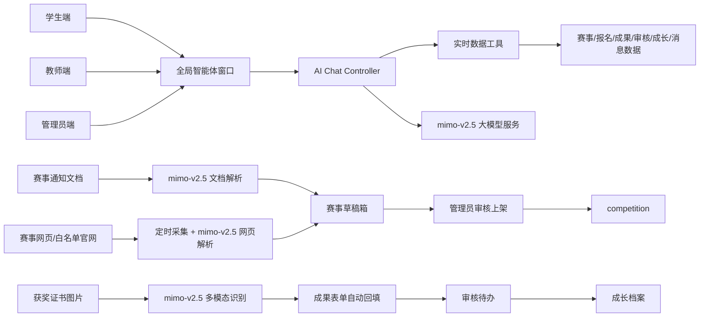

# 易赛通 AI 能力增强需求文档

适用项目：易赛通 - 高校赛事服务平台  
参赛方向：2026 年易班创新大赛  
文档版本：v0.1  
编写日期：2026-06-05

## 1. 背景与目标

当前项目已经具备高校赛事平台的完整基础能力，覆盖学生端、教师端、管理员端，包含赛事发布、报名审核、组队招募、成果上传、成长档案、消息通知、优秀作品展示等流程。后端已有 `competition`、`submission`、`review_task`、`growth_record`、`message` 等核心表，前端已有 `CompetitionPublish`、`AchievementUpload`、`SubmissionAudit`、`Layout` 等关键入口，适合在现有业务链路上叠加 AI 能力。

本轮需求目标不是单独做一个 AI 聊天页面，而是把大模型、多模态识别、文档解析、网页采集能力嵌入赛事全生命周期，使平台从“人工录入和审核系统”升级为“AI 辅助的赛事发现、发布、申报、证明识别和成长归档系统”。

核心参赛表达：

- 管理员少录入：上传通知文档或给出网页链接，AI 自动抽取赛事信息并生成草稿。
- 学生少填表：上传获奖证书图片，AI 自动识别奖项信息并回填成果表单。
- 三端会提问：学生、教师、管理员均可通过智能体查询实时赛事、报名、审核、成长数据。
- 平台会发现：定时采集赛事白名单和指定官网，自动生成待审核赛事草稿。

## 2. 现有项目承接点

### 2.1 前端承接点

- 全局布局：`Yiban/src/components/Layout.tsx` 可挂载全局智能体浮窗，使学生、教师、管理员三端共用。
- 管理员赛事发布：`Yiban/src/pages/admin/CompetitionPublish.tsx` 已有草稿、发布、编辑、封面上传逻辑，可扩展“AI 解析结果预填”和“AI 草稿箱”。
- 学生获奖上传：`Yiban/src/pages/student/AchievementUpload.tsx` 已有赛事选择、团队成员选择、文件上传、提交审核能力，可扩展“证书识别并自动填表”。
- 审核页面：管理员和教师已有成果审核入口，可展示 AI 识别结果、置信度和字段来源，辅助人工复核。

### 2.2 后端承接点

- `competition.status` 已支持 `draft/published/closed`，适合承接 AI 文档解析和爬取生成的赛事草稿。
- `submission` 和 `submission_student` 已支持团队成果上传，适合承接获奖证明附件。
- `review_task` 已支持统一待办，适合把 AI 识别后的证书成果、爬取赛事草稿纳入审核队列。
- `growth_record` 已支持 `award/certificate` 类型，可在证书审核通过后自动形成学生成长记录。
- `message` 已支持站内消息，可用于 AI 推荐、草稿审核提醒、证书识别结果通知。
- 后端已有 Redis、文件上传、七牛云上传、Swagger、JWT 角色拦截，适合新增异步任务、权限控制和 AI 接口。

## 3. 推荐建设路线

### 方案 A：平台内嵌式大模型服务层，推荐

在 Spring Boot 后端新增 `ai` 模块，通过统一的 `AiModelService` 对接 `mimo-v2.5` 大模型。文档解析、证书图片识别、网页内容抽取、赛事去重判断、智能体问答、推荐理由生成、审核意见草稿等“智能判断”全部交给大模型完成；后端只负责文件存储、网页抓取、权限校验、任务编排、数据库工具调用和审核闭环。前端只调用平台后端接口，所有鉴权、数据范围、审核流程仍由现有系统控制。

优点：

- 与当前代码结构最匹配，改造成本低。
- 可以复用现有 `competition`、`submission`、`review_task`、`growth_record`。
- 便于做参赛演示：AI 输出结果马上进入平台真实业务流程。
- 权限、审计、数据脱敏更可控。
- 全部 AI 能力使用同一个大模型入口，产品叙事更统一，答辩时更容易讲清楚。

不足：

- 大模型调用、图片识别、长文档解析、爬取内容抽取会让后端任务编排更复杂，需要做好任务表、失败重试、调用限额和结果缓存。

### 方案 B：独立 AI 微服务

使用 Python 或独立 Java 服务承接大模型调用、文件预处理、网页采集和智能体工具调用，主后端只负责业务数据。

优点：

- AI 计算与业务系统解耦，后续扩展性强。
- Python 生态更适合复杂爬虫、文件转换、多模态模型试验。

不足：

- 需要新增服务编排、接口鉴权、部署脚本和数据同步，对参赛时间不够友好。
- 前期演示成本高，容易把精力消耗在工程集成上。

### 方案 C：传统识别与多供应商混合接入，不推荐

同时接入多个第三方传统识别、文档智能解析、网页摘要和大模型 API，把识别结果回填到平台。

优点：

- 上手快，识别准确率更容易达到演示效果。
- 适合短期做高质量 Demo。

不足：

- 多供应商配置复杂，成本和数据合规需要说明。
- 技术亮点容易被认为只是调用云接口，需要结合平台业务闭环和审计机制增强原创性。

推荐采用方案 A：统一使用 `mimo-v2.5` 大模型作为 AI 能力核心。也就是“平台内嵌大模型编排 + 业务数据工具调用 + 人工审核闭环”的模式。除文件读取、图片上传、网页抓取、数据库查询等基础工程能力外，不再额外引入传统 OCR 或规则分类作为主识别方案。

## 4. 大模型接入约定

### 4.1 模型配置

本项目 AI 能力统一接入以下大模型服务：

| 配置项 | 取值 |
| --- | --- |
| API Base URL | `https://token-plan-cn.xiaomimimo.com/v1` |
| 模型名称 | `mimo-v2.5` |
| 上下文窗口 | `1000000` tokens |
| 接口风格 | 按 OpenAI-compatible Chat Completions 风格封装 |
| API Key | 通过环境变量 `AI_API_KEY` 注入，禁止写入代码仓库和需求文档 |

建议后端配置项：

```yaml
ai:
  base-url: ${AI_BASE_URL:https://token-plan-cn.xiaomimimo.com/v1}
  api-key: ${AI_API_KEY}
  model: ${AI_MODEL:mimo-v2.5}
  context-window: ${AI_CONTEXT_WINDOW:1000000}
  timeout-seconds: 120
```

### 4.2 统一调用原则

- 文档解析：PDF、DOCX、TXT、通知图片等内容统一交给 `mimo-v2.5` 抽取结构化赛事字段。
- 证书识别：获奖证书图片统一交给 `mimo-v2.5` 进行多模态识别，不再把传统 OCR 作为主流程。
- 网页采集：爬虫只负责拿到公开网页内容，是否为赛事、字段抽取、重复风险说明统一由 `mimo-v2.5` 判断。
- 智能体问答：模型只能通过后端工具获取实时数据，不能直接访问数据库，也不能越权查询。
- 推荐与总结：赛事推荐、成长报告、审核意见草稿、公告文案统一由 `mimo-v2.5` 生成。
- 长上下文使用：复杂文档、批量网页、历史对话优先利用 100 万 token 上下文；同时保留分段摘要和结果缓存，防止单次调用过慢或成本失控。
- 密钥安全：密钥只放在本地环境变量、服务器环境变量或部署平台密钥配置中，不写入 Markdown、Java、TypeScript、YAML 示例明文。

## 5. 总体功能架构



## 6. 功能需求

### 6.1 AI 文档自动解析并创建赛事草稿

#### 5.1.1 使用场景

管理员收到赛事通知、红头文件、PDF、Word、图片海报或赛事官网说明。管理员只需要上传文档，系统自动识别赛事名称、报名时间、比赛时间、主办单位、级别、分类、团队人数、赛道、标签、赛事说明、阶段安排等字段，并生成可编辑的赛事草稿。

#### 5.1.2 功能入口

- 管理员端新增“AI 导入赛事”入口，可放在“赛事发布”页面顶部。
- 管理员端新增“AI 草稿箱”入口，可放在“赛事管理”或“工作台待办”中。

#### 5.1.3 用户流程

1. 管理员点击“AI 导入赛事”。
2. 上传 PDF、DOCX、TXT、图片，或输入赛事网页 URL。
3. 系统创建解析任务，显示任务状态：等待中、解析中、已完成、解析失败。
4. AI 输出结构化字段，并给出每个字段的置信度和来源片段。
5. 管理员在预览页确认或修改字段。
6. 点击“保存草稿”，系统创建 `competition.status=draft` 的赛事。
7. 点击“发布”，走现有赛事发布逻辑。

#### 5.1.4 识别字段

| 字段 | 说明 | 对应现有字段 |
| --- | --- | --- |
| 赛事名称 | 文档中的完整比赛名称 | `competition.name` |
| 赛事级别 | 国家级、省级、校级、院级 | `competition.level` |
| 赛事分类 | 科技创新、商业创业、文化艺术等 | `competition.category` |
| 主办单位 | 主办、承办、协办单位优先提取主办单位 | `competition.organizer` |
| 报名开始/截止 | 支持自然语言日期解析 | `start_time/end_time` |
| 比赛开始/结束 | 支持初赛、复赛、决赛时间推断 | `competition_start/competition_end` |
| 团队人数 | 个人赛为 1，团队赛提取上限 | `max_team_size` |
| 赛道列表 | 如 AI 大模型、软件开发、数字媒体 | `tracks` |
| 标签 | 学科竞赛、创新创业、企业赛等 | `tags` |
| 赛事说明 | 简介、参赛要求、提交材料、奖项设置 | `content` |
| 阶段安排 | 报名、初赛、复赛、决赛、作品提交 | `competition_stage` |

#### 5.1.5 AI 输出要求

AI 必须返回结构化 JSON，而不是只返回自然语言摘要。建议响应结构：

```json
{
  "name": "第十一届中国国际大学生创新大赛校内选拔赛",
  "level": "校级",
  "category": "B",
  "organizer": "创新创业学院",
  "startTime": "2026-06-10 00:00:00",
  "endTime": "2026-07-01 23:59:59",
  "competitionStart": "2026-07-10 00:00:00",
  "competitionEnd": "2026-08-20 23:59:59",
  "maxTeamSize": 5,
  "tracks": ["AI 大模型", "创业实践"],
  "tags": ["创新创业", "校内选拔"],
  "content": "赛事简介与参赛要求...",
  "stages": [
    {
      "name": "报名阶段",
      "startTime": "2026-06-10 00:00:00",
      "endTime": "2026-07-01 23:59:59",
      "description": "提交报名表和项目简介"
    }
  ],
  "fieldConfidence": {
    "name": 0.98,
    "endTime": 0.91,
    "maxTeamSize": 0.82
  },
  "evidence": {
    "endTime": "请各团队于 2026 年 7 月 1 日前完成报名..."
  }
}
```

#### 5.1.6 异常处理

- 低置信度字段用醒目标记，必须由管理员确认。
- 无法识别的字段留空，不自动臆造。
- 时间冲突时提示，例如报名截止晚于比赛开始。
- 文档中识别出多个赛事时，提示管理员拆分为多个草稿。
- 解析失败时保留原始文件和错误原因，允许重新解析。

### 6.2 三端全局智能体对话窗口

#### 5.2.1 使用场景

学生、教师、管理员在任意页面都可以打开智能体窗口，快速查询和办理赛事相关事务。智能体不是普通 FAQ，而是根据当前登录用户、角色权限、实时数据库数据和页面上下文回答。

#### 5.2.2 功能入口

在 `Layout.tsx` 中挂载 `AIAssistantWidget`，固定在页面右下角。移动端显示为悬浮按钮，点击后底部抽屉展开。

#### 5.2.3 角色能力

学生端：

- 查询“我能报名哪些比赛”
- 查询“我的报名审核到哪一步了”
- 查询“我上传的成果有没有通过”
- 推荐适合本专业、年级、能力画像的赛事
- 解释赛事规则、报名材料和截止时间
- 根据成果/获奖记录生成个人成长总结

教师端：

- 查询本学院待审核成果数量
- 查询某学生参赛与成长记录
- 生成班级参赛情况摘要
- 发现临近截止但未提交成果的学生
- 辅助生成审核评语，但最终必须人工确认

管理员端：

- 查询待发布草稿、待审核成果、异常解析任务
- 询问某赛事报名人数、阶段进度、作品提交情况
- 让 AI 生成公告初稿、赛事简介、推送文案
- 分析爬取来源命中情况和重复赛事

#### 5.2.4 实时数据工具

智能体回答必须通过后端受控工具读取实时数据，不能让大模型直接拼 SQL。建议工具如下：

| 工具名 | 数据来源 | 角色限制 |
| --- | --- | --- |
| `searchCompetitions` | 赛事列表与详情 | 三端可用，非管理员仅 published |
| `getMyRegistrations` | 我的报名 | 学生 |
| `getMySubmissions` | 我的成果 | 学生 |
| `getReviewSummary` | 审核待办统计 | 教师、管理员 |
| `getStudentGrowth` | 成长档案、雷达图 | 学生本人、教师同学院、管理员 |
| `getMessages` | 站内消息 | 当前用户 |
| `getDraftCompetitions` | 赛事草稿 | 管理员 |
| `getAiTaskStatus` | AI 解析/爬取任务 | 管理员 |

#### 5.2.5 对话边界

- 智能体可以查询、解释、生成草稿。
- 智能体不直接替用户提交报名、发布赛事、审核通过成果。
- 涉及写操作时，智能体只能生成“待确认操作卡片”，用户点击确认后调用业务接口。
- 涉及个人数据时必须遵循当前角色权限。
- 所有回答需带数据时间，例如“以下数据更新于 2026-06-05 17:00”。

### 6.3 证书/获奖证明自动识别与录入

#### 5.3.1 使用场景

学生上传获奖证书图片或扫描件，例如“演讲比赛一等奖”。系统自动识别比赛名称、获奖等级、获奖时间、主办单位、获奖人、证书编号等信息，并自动填入成果上传表单。学生确认后提交审核，审核通过后自动进入成长档案。

这是最推荐优先落地的功能，因为它兼具大模型多模态识别、业务数据联动、审核闭环和成长档案沉淀，参赛展示效果强。

#### 5.3.2 功能入口

在学生端 `AchievementUpload.tsx` 增加“AI 识别证书”区域：

- 上传证书图片。
- 显示识别中状态。
- 展示识别结果表单。
- 支持学生手动修改。
- 展示字段置信度和识别来源。
- 提交后进入教师/管理员审核。

#### 5.3.3 识别字段

| 字段 | 说明 |
| --- | --- |
| competitionName | 比赛/活动名称 |
| awardLevel | 获奖等级，如一等奖、二等奖、优秀奖 |
| awardTime | 获奖或颁发时间 |
| organizer | 主办单位 |
| winnerName | 获奖人或团队名称 |
| certificateNo | 证书编号，没有则为空 |
| sealText | 印章文字或落款单位 |
| matchedCompetitionId | 与平台赛事库匹配到的赛事 ID |
| confidence | 综合置信度 |

#### 5.3.4 平台联动

- 若识别到的比赛名称与现有 `competition` 高度相似，自动关联该赛事。
- 若未匹配到赛事，允许学生选择“未收录赛事”，系统创建待审核的外部获奖记录。
- 若识别到团队成员，允许学生补充关联成员。
- 审核通过后：
  - 写入 `growth_record.record_type=award/certificate`。
  - 向相关学生发送 `message`。
  - 可选择把作品/证明展示到优秀作品库。

#### 5.3.5 风险控制

- 文件 hash 去重，避免同一证书重复上传。
- 同一学生、同一赛事、同一获奖等级重复提交时提示。
- 低置信度字段必须人工确认。
- 支持教师/管理员查看原图、识别结果、修改历史和 AI 证据。
- 可扩展证书真伪核验：二维码识别、官网查询链接、印章区域检测、图片篡改风险提示。

### 6.4 赛事白名单与网页自动采集

#### 5.4.1 使用场景

系统每天自动采集学校认可的大学生赛事白名单、教育类官网、企业赛事官网或管理员配置的网页来源。AI 抽取赛事信息并推送到“AI 草稿箱”，管理员审核后上架。

#### 5.4.2 功能入口

管理员端新增“赛事来源管理”和“AI 草稿箱”：

- 来源管理：配置网页名称、URL、采集频率、启用状态、来源类型。
- AI 草稿箱：查看采集到的赛事草稿、来源、重复风险、字段置信度。

#### 5.4.3 采集流程

1. 系统按计划任务扫描启用来源。
2. 爬取列表页和详情页，提取标题、正文、发布时间、链接。
3. 使用规则和大模型判断是否为赛事信息。
4. 对有效赛事进行结构化抽取。
5. 与现有 `competition` 做重复检测。
6. 生成 `draft` 状态赛事或采集草稿记录。
7. 管理员审核并发布。

#### 5.4.4 合规与稳定性

- 尊重网站访问频率，设置限速、超时、重试。
- 支持 robots/站点规则配置。
- 仅采集公开网页，不采集需要登录或敏感数据的页面。
- 保存来源 URL 和采集时间，便于管理员溯源。
- 对企业赛事、商业推广、无明确主办单位的内容打风险标签。

## 7. 建议新增数据模型

### 7.1 AI 任务表 `ai_task`

用于统一记录文档解析、证书识别、网页解析、智能体工具调用等任务。

| 字段 | 类型 | 说明 |
| --- | --- | --- |
| id | bigint | 主键 |
| task_type | varchar | competition_doc_parse / certificate_recognition / crawler_parse / chat |
| status | varchar | pending / running / succeeded / failed |
| source_type | varchar | file / image / url / text |
| source_url | varchar | 文件地址或网页地址 |
| requester_id | bigint | 发起人 |
| result_json | text | AI 结构化结果 |
| confidence | decimal | 综合置信度 |
| error_message | varchar | 失败原因 |
| create_time | datetime | 创建时间 |
| update_time | datetime | 更新时间 |

### 7.2 获奖证明表 `award_proof`

用于保存证书识别和审核结果。

| 字段 | 类型 | 说明 |
| --- | --- | --- |
| id | bigint | 主键 |
| submitter_id | bigint | 上传学生 |
| competition_id | bigint | 关联赛事，可为空 |
| competition_name | varchar | 识别或手填赛事名称 |
| award_level | varchar | 获奖等级 |
| award_time | datetime | 获奖时间 |
| organizer | varchar | 主办单位 |
| certificate_no | varchar | 证书编号 |
| file_url | varchar | 证书图片地址 |
| ai_task_id | bigint | 对应 AI 识别任务 |
| confidence | decimal | 综合置信度 |
| status | varchar | pending / approved / rejected / returned |
| review_note | varchar | 审核意见 |
| reviewer_id | bigint | 审核人 |
| review_time | datetime | 审核时间 |
| create_time | datetime | 创建时间 |

### 7.3 采集来源表 `competition_source`

用于管理员配置赛事采集来源。

| 字段 | 类型 | 说明 |
| --- | --- | --- |
| id | bigint | 主键 |
| name | varchar | 来源名称 |
| url | varchar | 来源地址 |
| source_type | varchar | whitelist / school / government / enterprise / custom |
| crawl_frequency | varchar | daily / weekly / manual |
| enabled | tinyint | 是否启用 |
| last_crawl_time | datetime | 最近采集时间 |
| create_time | datetime | 创建时间 |

### 7.4 智能体会话表 `ai_conversation`

用于保存对话审计和上下文，不保存敏感明文时可只保留摘要。

| 字段 | 类型 | 说明 |
| --- | --- | --- |
| id | bigint | 主键 |
| user_id | bigint | 用户 |
| role | varchar | student / teacher / admin |
| title | varchar | 会话标题 |
| last_message_at | datetime | 最近消息时间 |
| create_time | datetime | 创建时间 |

## 8. 建议新增接口

### 8.1 AI 文档解析

- `POST /api/ai/competition/parse-file`：上传文档并创建解析任务。
- `POST /api/ai/competition/parse-url`：输入 URL 并创建解析任务。
- `GET /api/ai/task/{id}`：查询 AI 任务状态和结果。
- `POST /api/ai/competition/create-draft`：根据解析结果创建赛事草稿。

### 8.2 证书识别

- `POST /api/ai/certificate/recognize`：上传证书图片并识别。
- `POST /api/award-proof/submit`：确认识别结果并提交审核。
- `GET /api/award-proof/my`：学生查看自己的获奖证明。
- `GET /api/award-proof/audit-list`：教师/管理员查看待审核证明。
- `POST /api/award-proof/review`：审核获奖证明。

### 8.3 智能体

- `POST /api/ai/chat`：普通对话。
- `POST /api/ai/chat/stream`：流式对话，建议 SSE。
- `GET /api/ai/chat/conversations`：获取会话列表。
- `GET /api/ai/chat/conversations/{id}`：获取会话详情。

### 8.4 自动采集

- `POST /api/admin/competition-sources`：新增采集来源。
- `GET /api/admin/competition-sources`：来源列表。
- `POST /api/admin/competition-sources/{id}/crawl`：手动触发采集。
- `GET /api/admin/competition-drafts`：AI 草稿箱列表。
- `POST /api/admin/competition-drafts/{id}/publish`：审核并发布草稿。

## 9. 页面需求

### 9.1 管理员端

#### AI 导入赛事

- 上传文件区域。
- 输入 URL 区域。
- 解析任务进度。
- 结构化字段预览。
- 字段置信度与来源片段。
- 保存草稿、直接发布、重新解析。

#### AI 草稿箱

- 草稿列表：赛事名称、来源、更新时间、置信度、重复风险、状态。
- 筛选：来源类型、置信度、是否疑似重复。
- 操作：查看详情、编辑、发布、忽略、合并到已有赛事。

#### 赛事来源管理

- 来源 URL 配置。
- 启用/停用。
- 最近采集结果。
- 手动采集按钮。

### 9.2 学生端

#### 获奖证明智能上传

- 上传证书图片。
- AI 识别结果表单。
- 赛事自动匹配提示。
- 手动修正字段。
- 关联团队成员。
- 提交审核。

#### 智能体快捷问题

- “我最近有哪些比赛快截止？”
- “我适合报名什么比赛？”
- “我的成果审核到哪一步了？”
- “帮我生成一段参赛经历总结。”

### 9.3 教师端

#### 审核辅助

- 成果审核页展示 AI 识别字段。
- 对比学生填报信息与证书识别信息。
- 标记风险：姓名不一致、赛事不匹配、时间异常、重复证书。
- AI 生成审核意见草稿，教师确认后提交。

#### 智能体快捷问题

- “本学院还有多少成果待审核？”
- “哪些学生参赛活跃但还没有获奖记录？”
- “帮我总结本月学院赛事参与情况。”

## 10. AI 能力与提示词要求

### 10.1 结构化输出原则

- 所有关键 AI 任务必须输出 JSON。
- 所有字段必须带置信度。
- 涉及日期必须规范化为后端可接收的时间格式。
- 不确定字段必须为空或标记低置信度，不允许编造。
- 输出中必须保存证据片段，便于人工审核。

### 10.2 大模型提示词方向

文档解析提示词应强调：

- 你是高校赛事通知解析助手。
- 只抽取文档中明确出现或可由上下文强推断的信息。
- 输出符合指定 JSON Schema。
- 日期统一转换为 `yyyy-MM-dd HH:mm:ss`。
- 若出现多个赛事，返回数组。

证书识别提示词应强调：

- 你是获奖证书多模态结构化识别助手。
- 优先识别比赛名称、获奖等级、获奖人、主办单位、落款时间。
- 如果字段被遮挡或无法判断，返回空值并降低置信度。
- 不根据常识补全证书编号或获奖时间。

智能体提示词应强调：

- 你是易赛通平台助手。
- 回答必须基于工具返回的数据。
- 不越权查询其他用户数据。
- 对写操作只生成确认卡片，不直接执行。
- 给出简短、可行动的回答。

## 11. 非功能需求

### 11.1 安全与权限

- 所有 AI 接口必须走 JWT 鉴权。
- 学生只能查看自己的报名、成果、证书和成长记录。
- 教师只能查看本学院学生数据。
- 管理员可以查看全部 AI 任务和草稿。
- AI 请求日志不得保存用户密码、Token 等敏感信息。

### 11.2 可解释性

- AI 解析结果必须展示来源文本、来源图片或来源 URL。
- 对低置信度字段进行明显提示。
- 管理员/教师可以查看 AI 原始输出和人工修改记录。

### 11.3 稳定性

- AI 任务异步执行，避免页面长时间阻塞。
- 任务失败可重试。
- 大模型不可用时，上传、报名、审核等原有业务不受影响。
- 采集任务限速，避免影响目标网站和自身服务。

### 11.4 成本控制

- 对同一文件 hash 命中时复用解析结果。
- 对同一 URL 内容未变化时不重复调用大模型。
- 智能体默认只取必要数据，避免把大量数据库记录直接塞给模型。
- 管理员可配置每日 AI 调用上限。

## 12. 验收标准

### 12.1 AI 文档解析

- 管理员上传一份赛事通知 PDF/DOCX 后，系统能生成赛事草稿。
- 至少能正确识别赛事名称、主办单位、报名截止时间、团队人数、赛事说明。
- 字段可编辑，保存后能进入现有赛事管理列表。
- 草稿不会被学生端看到，发布后学生端可见。

### 12.2 智能体

- 学生能查询自己的报名和成果状态。
- 教师能查询待审核任务统计。
- 管理员能查询 AI 草稿箱数量。
- 智能体不会向学生泄露其他学生数据。
- 至少支持 3 个角色各 3 个快捷问题。

### 12.3 证书识别

- 学生上传证书图片后，系统能自动填入比赛名称、获奖等级、获奖时间、主办单位。
- 学生可修改识别结果。
- 提交后进入教师/管理员审核。
- 审核通过后自动生成成长记录和站内消息。
- 重复证书或低置信度证书有风险提示。

### 12.4 自动采集

- 管理员能配置至少一个采集来源。
- 系统能手动或定时采集网页内容。
- 有效赛事能进入 AI 草稿箱。
- 疑似重复赛事会提示管理员。
- 管理员确认后可发布到赛事大厅。

## 13. 优先级与里程碑

### 第一阶段：证书识别与成长档案闭环

优先级最高。先做学生上传证书、AI 识别、自动填表、提交审核、审核通过写入成长记录。该功能技术硬核，演示链路短，最适合作为比赛核心亮点。

交付内容：

- `award_proof` 数据表。
- 证书识别接口。
- 学生端证书识别表单。
- 审核端 AI 识别结果展示。
- 审核通过后成长记录和消息联动。

### 第二阶段：AI 文档解析生成赛事草稿

承接管理员赛事发布流程，减少人工录入。该功能能体现“平台治理效率提升”。

交付内容：

- `ai_task` 数据表。
- 文档上传解析接口。
- 管理员 AI 导入赛事页面。
- 解析结果预填 `CompetitionPublish`。
- 创建 `competition.status=draft` 草稿。

### 第三阶段：全局智能体

将 AI 从单点识别升级为贯穿三端的交互入口。注意智能体必须接入实时业务数据工具。

交付内容：

- `AIAssistantWidget`。
- `AiChatController`。
- 角色化工具调用。
- 对话记录和快捷问题。

### 第四阶段：赛事自动采集与 AI 草稿箱

作为高级扩展能力，用于体现平台主动发现赛事资源。该阶段需要更多稳定性和合规设计，可作为比赛答辩中的后续拓展或增强演示。

交付内容：

- `competition_source` 数据表。
- 定时采集任务。
- URL 内容解析。
- AI 草稿箱。
- 重复检测和发布审核。

## 14. 额外可增强功能

### 14.1 AI 赛事推荐

根据学生专业、年级、参赛历史、能力雷达、报名截止时间，推荐适合报名的赛事。推荐理由要可解释，例如“你已参加过软件开发类比赛，当前 AI 大模型赛道与能力画像匹配度较高”。

### 14.2 报名材料预审

学生提交报名前，AI 根据赛事要求检查报名表、队伍人数、作品材料是否完整，提示缺漏项。

### 14.3 教师审核意见生成

教师审核成果时，AI 根据证书识别结果、成果文件名、赛事要求生成审核意见草稿，但必须由教师确认。

### 14.4 学生成长报告生成

学生或教师可一键生成“个人赛事成长报告”，包含参赛时间轴、获奖记录、能力雷达解读和下一步赛事建议。

## 15. 参赛展示建议

建议答辩时演示一条完整闭环：

1. 学生上传一张获奖证书。
2. AI 自动识别比赛名称、获奖等级、时间、主办单位。
3. 学生确认后提交审核。
4. 教师端看到 AI 识别结果和风险提示，一键审核通过。
5. 学生成长档案自动增加获奖记录。
6. 学生打开智能体询问“我的获奖记录有哪些”，智能体基于实时数据回答。
7. 管理员上传一份赛事通知文档，AI 解析并生成赛事草稿。

这条演示能同时覆盖大模型多模态识别、结构化抽取、审核闭环、成长档案、实时智能体和管理员降本增效，比较适合 2026 年易班创新大赛的产品完整度与技术创新表达。

## 16. 已确定事项与待确认问题

- 已确定：统一使用 `mimo-v2.5` 大模型，API Base URL 为 `https://token-plan-cn.xiaomimimo.com/v1`，上下文窗口配置为 `1000000` tokens。
- 已确定：文档解析、证书图片识别、网页赛事抽取、智能体问答、推荐与总结全部走大模型能力，不再把传统 OCR 或规则分类作为主流程。
- 赛事白名单来源：由管理员手工配置，还是内置学校认可清单。
- 获奖证明审核角色：由教师审核、管理员审核，还是按学院/赛事归属自动分派。
- 是否需要把 AI 识别结果纳入综测加分规则，如果需要，应补充积分换算需求。
