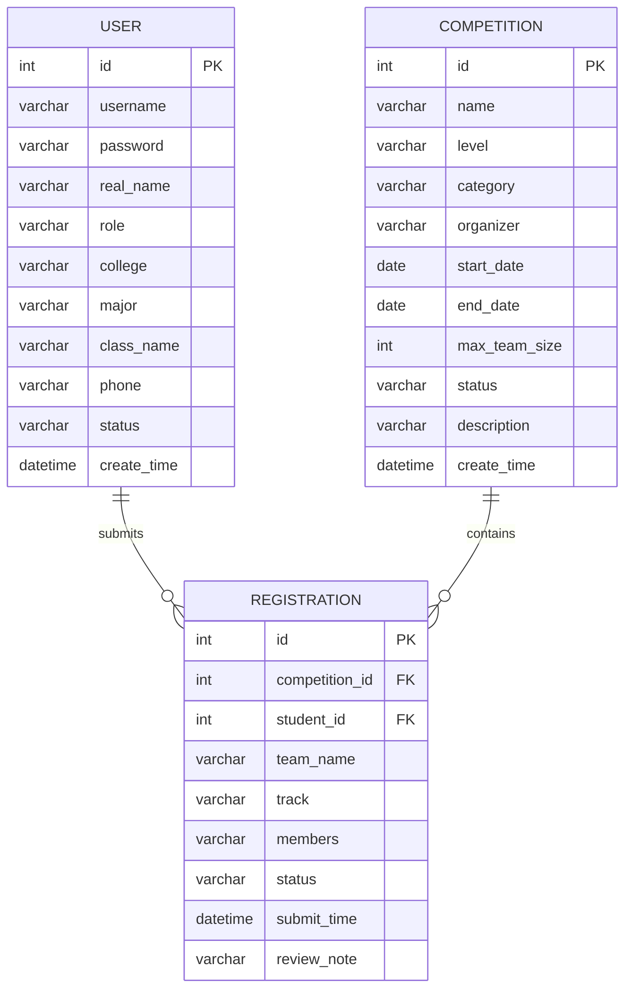

# 《系统综合应用开发》实验报告素材

## 一、系统简介

本系统名称为“高校赛事管理系统”。系统面向高校赛事管理场景，主要解决赛事信息发布、学生在线报名、教师或管理员审核报名信息、用户信息统一维护等问题。系统采用 MVC 分层开发思想，JSP 页面负责数据展示和表单提交，Servlet 负责接收请求和页面跳转，Service 层负责业务逻辑处理，DAO 层负责访问 MySQL 数据库，POJO 类负责封装数据库表数据，Util 包负责提供数据库连接等公共工具，Tag 包负责实现页面状态标签复用。

系统当前实现了登录、用户信息管理、赛事信息管理、报名信息管理等功能。管理员登录后可以查看系统首页统计数据，可以查询全部用户、全部赛事、全部报名记录，也可以对数据进行新增、修改和删除操作。系统页面结构清晰，数据库表之间通过外键建立联系，能够体现 JSP、Servlet、Service、DAO、POJO、Util、Tag 各层之间的协作关系。

## 二、工程目录结构

建议在 IDEA 左侧 Project 视图展开 `mvc-yiban-coursework` 后截图。核心目录如下：

```text
mvc-yiban-coursework
├── db
│   └── yiban_mvc.sql
├── pom.xml
├── src/main/java/cn/edu/lingnan
│   ├── dao
│   ├── pojo
│   ├── service
│   ├── servlet
│   ├── tag
│   └── util
├── src/main/resources
│   └── db.properties
└── src/main/webapp
    ├── assets/css/style.css
    ├── index.jsp
    └── WEB-INF
        ├── jsp
        └── tld/lingnan.tld
```

## 三、MySQL 数据库 ER 图

本系统主要包含三张业务表：

- `user`：用户信息表，保存管理员、教师、学生账号。
- `competition`：赛事信息表，保存赛事名称、级别、类别、时间和状态。
- `registration`：报名信息表，保存学生对赛事的报名记录。

关系说明：

- 一个用户可以有多条报名记录，`registration.student_id` 外键关联 `user.id`。
- 一个赛事可以有多条报名记录，`registration.competition_id` 外键关联 `competition.id`。
- `registration` 是用户和赛事之间的关联业务表。

可使用下列 Mermaid ER 图作为画图参考：



## 四、实验报告截图建议

运行系统后建议截图以下页面：

1. 登录页面：`http://localhost:8080/yiban-mvc-coursework/login`
2. 系统首页：`http://localhost:8080/yiban-mvc-coursework/dashboard`
3. 用户信息全表显示页面：`/users`
4. 赛事信息全表显示页面：`/competitions`
5. 报名信息全表显示页面：`/registrations`

## 五、实验报告建议粘贴的代码

代码不要截图，直接复制粘贴到 Word，字体设置为 Times New Roman，小五或五号，单倍行距。每段不超过两页，可只贴关键片段。

登录页面代码：

- `src/main/webapp/WEB-INF/jsp/login.jsp`
- `src/main/java/cn/edu/lingnan/servlet/LoginServlet.java`

查询全部用户信息显示页面代码：

- `src/main/webapp/WEB-INF/jsp/user-list.jsp`
- `src/main/java/cn/edu/lingnan/servlet/UserServlet.java`
- `src/main/java/cn/edu/lingnan/dao/UserDaoImpl.java` 中 `findAll` 方法

查询全部赛事信息显示页面代码：

- `src/main/webapp/WEB-INF/jsp/competition-list.jsp`
- `src/main/java/cn/edu/lingnan/servlet/CompetitionServlet.java`
- `src/main/java/cn/edu/lingnan/dao/CompetitionDaoImpl.java` 中 `findAll` 方法

查询全部报名信息显示页面代码：

- `src/main/webapp/WEB-INF/jsp/registration-list.jsp`
- `src/main/java/cn/edu/lingnan/servlet/RegistrationServlet.java`
- `src/main/java/cn/edu/lingnan/dao/RegistrationDaoImpl.java` 中 `findAll` 方法

## 六、软硬件环境写法

这一部分请根据你的电脑实际情况填写。示例：

```text
硬件环境：笔记本电脑，Intel/AMD 处理器，16GB 内存。
操作系统：Windows 11。
开发工具：IntelliJ IDEA 2024.x。
JDK 版本：JDK 17。
Web 服务器：Apache Tomcat 9。
数据库：MySQL 8.0。
浏览器：Microsoft Edge / Google Chrome。
```

## 七、实验结论与体会参考

通过本次系统综合应用开发实验，我进一步理解了 MVC 程序开发的基本流程。系统开发过程中，JSP 页面主要用于展示数据和提交表单，Servlet 作为控制器负责接收请求、调用业务层并转发页面，Service 层封装业务逻辑，DAO 层通过 JDBC 操作 MySQL 数据库，POJO 类负责封装数据库表记录，Util 包减少了重复代码，Tag 包提高了页面状态显示的复用性。

在实现高校赛事管理系统的过程中，我掌握了用户登录、数据查询、数据新增、数据修改和数据删除等常见 Web 功能的实现方式，也体会到分层设计能够降低系统耦合度，使代码结构更加清晰。通过数据库 ER 图设计，我理解了用户表、赛事表和报名表之间的一对多关系。通过运行测试和页面截图，我验证了系统能够正常连接数据库并完成基本业务操作。本次实验提升了我对 JSP、Servlet、JDBC 和 MySQL 综合应用开发的理解，也为后续开发更复杂的 Web 系统打下了基础。
